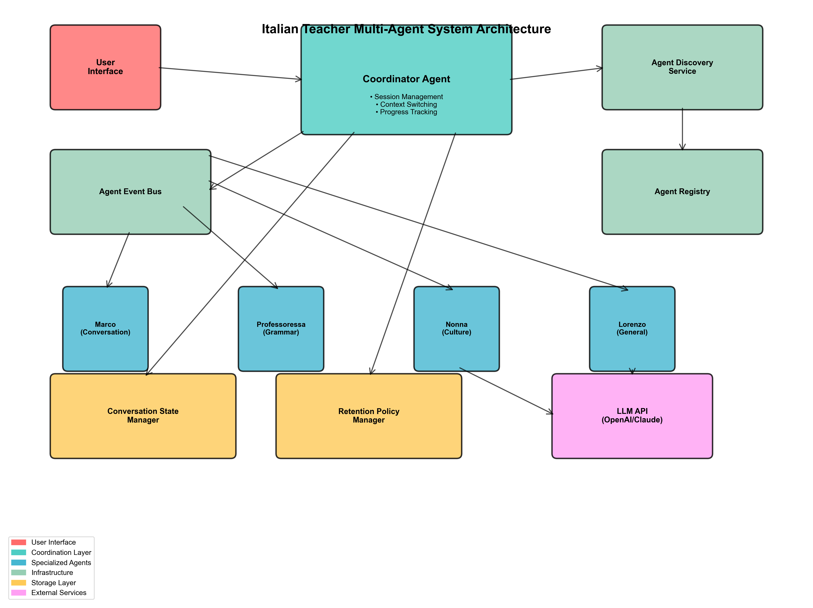
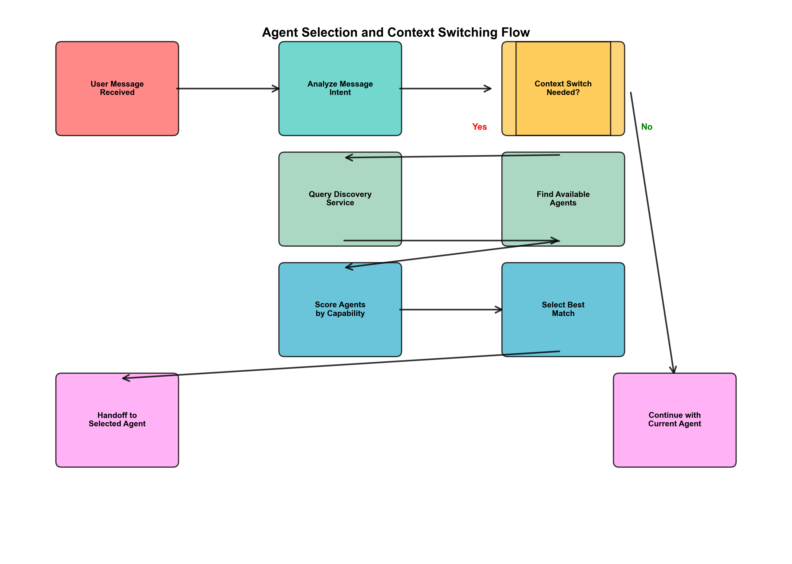
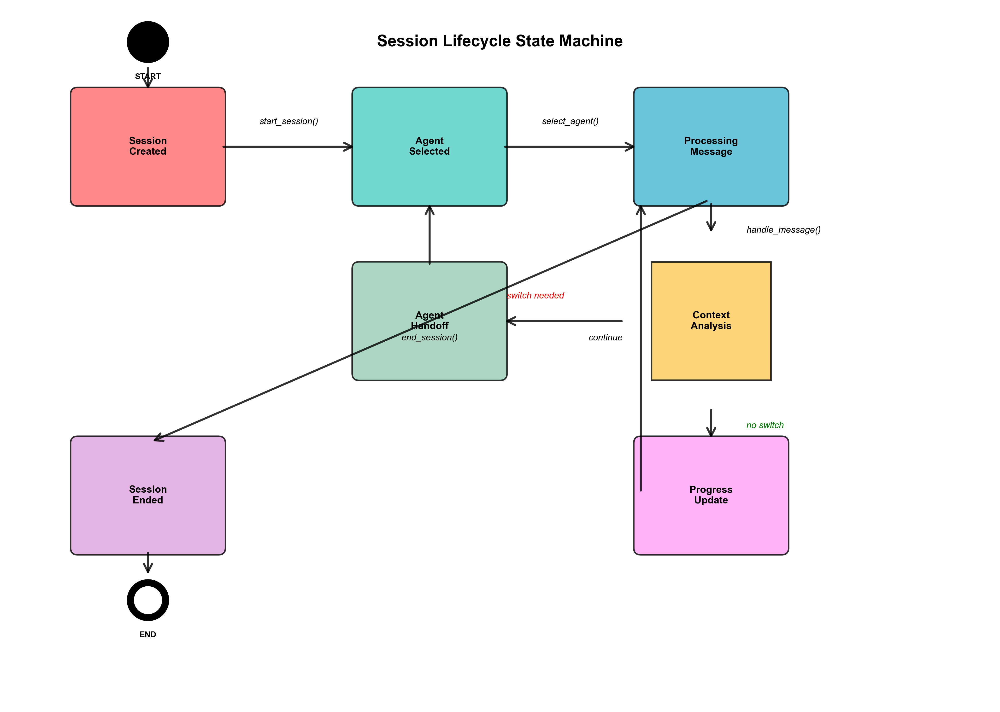
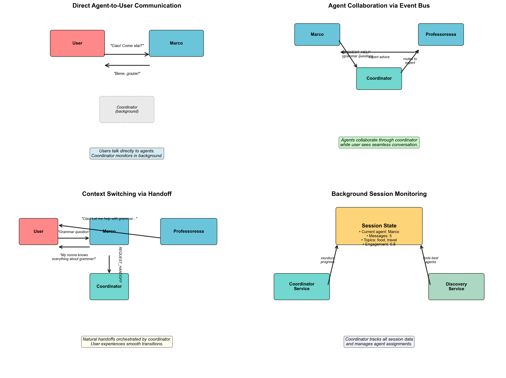
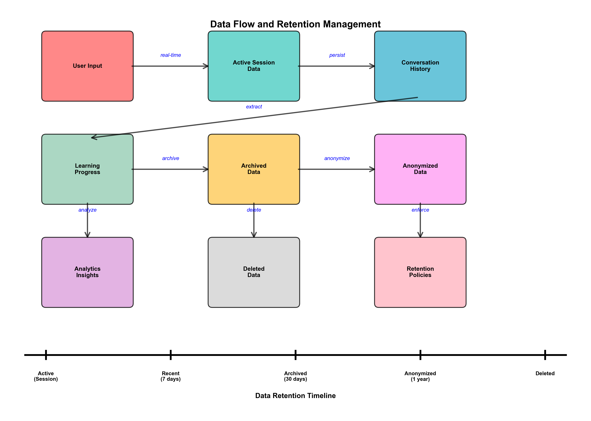

# Italian Teacher Multi-Agent System - Core Architecture

## Overview

The Italian Teacher is a sophisticated multi-agent system designed for personalized Italian language learning. The core architecture implements a **background coordinator pattern** where:

- **Users interact directly with specialized Italian agents** (Marco, Professoressa, Nonna, Lorenzo)
- **Coordinator works invisibly behind the scenes** to orchestrate handoffs and collaboration
- **Natural conversation flow** with agents presenting themselves as Italian family members
- **Event-driven coordination** enables seamless agent collaboration and context switching

## Key Architectural Principles

1. **Direct Agent-User Communication**: No intermediary - users talk directly to agents
2. **Background Orchestration**: Coordinator monitors and facilitates without interrupting conversation flow  
3. **Natural Handoffs**: Agent transitions feel like family member introductions
4. **Event-Driven Collaboration**: Agents request help through events, not direct calls
5. **Invisible Progress Tracking**: Learning progress monitored without user awareness

## System Architecture



The system follows a coordinator-based architecture pattern where a central CoordinatorAgent orchestrates interactions between users and specialized language learning agents. The architecture is designed for scalability, resilience, and intelligent context switching.

## Core Components

### 1. BaseAgent Framework
**Location**: [`src/core/base_agent.py`](../src/core/base_agent.py)

The foundation of all agents in the system, providing:
- **Abstract base class** for all specialized agents
- **Conversation management** with context persistence
- **Activity tracking** and status monitoring
- **Error handling** and resilience patterns

#### Key Classes:
- `BaseAgent` ([line 150](../src/core/base_agent.py#L150)): Abstract base with required methods
- `AgentPersonality` ([line 44](../src/core/base_agent.py#L44)): Defines agent behavior and traits
- `ConversationContext` ([line 90](../src/core/base_agent.py#L90)): Manages conversation state
- `AgentMessage` ([line 20](../src/core/base_agent.py#L20)): Standardized message format

#### Abstract Methods:
```python
async def can_handle_message(self, message: str, context: ConversationContext) -> bool
async def generate_response(self, message: str, context: ConversationContext) -> str
async def handle_event(self, event: AgentEvent) -> Optional[AgentResponse]
```

### 2. Agent Registry & Discovery System
**Location**: [`src/core/agent_registry.py`](../src/core/agent_registry.py), [`src/core/agent_discovery.py`](../src/core/agent_discovery.py)

Manages agent lifecycle, capabilities, and intelligent selection:

#### Agent Registry ([line 120](../src/core/agent_registry.py#L120))
- **Agent registration** and health monitoring
- **Load balancing** based on current session counts
- **Capability scoring** for agent selection
- **Heartbeat mechanism** for agent health ([line 95](../src/core/agent_registry.py#L95))

#### Discovery Service ([line 30](../src/core/agent_discovery.py#L30))
- **Context-aware agent selection** using specialized algorithms
- **Help request routing** based on agent capabilities
- **Load-balanced assignment** to prevent agent overload

#### Agent Selection Flow:



This flow diagram shows how the system intelligently selects agents based on message intent, agent capabilities, and current load balancing requirements.

### 3. Coordinator Service (Phase 1.3)
**Location**: [`src/core/coordinator.py`](../src/core/coordinator.py)

A background service that orchestrates multi-agent conversations without direct user interaction:

#### Core Architecture:
- **Users never interact directly with the coordinator**
- **Agents communicate with users while coordinator monitors behind the scenes**
- **Event-driven coordination** through agent collaboration requests
- **Natural handoffs** that feel like family member introductions

#### Core Responsibilities:
1. **Session Management** ([line 151](../src/core/coordinator.py#L151))
   - Creates sessions when users start talking to agents
   - Tracks session state and progress invisibly
   - Manages session lifecycle behind the scenes

2. **Event-Based Coordination** ([line 133](../src/core/coordinator.py#L133))
   - Listens to agent REQUEST_HANDOFF events
   - Handles REQUEST_HELP for agent collaboration
   - Routes events to appropriate specialized agents

3. **Progress Tracking** ([line 357](../src/core/coordinator.py#L357))
   - Monitors agent conversations for topics and engagement
   - Updates session progress automatically
   - Tracks learning goal completion

4. **Agent Orchestration** ([line 178](../src/core/coordinator.py#L178))
   - Facilitates smooth agent handoffs
   - Provides context for natural transitions
   - Ensures conversation continuity

#### Background Service Flow:



The coordinator operates as a background service that responds to agent events rather than managing user interactions directly. This creates a more natural conversation experience.

### 4. Event-Driven Communication
**Location**: [`src/core/agent_events.py`](../src/core/agent_events.py), [`src/core/event_bus.py`](../src/core/event_bus.py)

Enables agents to collaborate and coordinate:

#### Event Types ([line 19](../src/core/agent_events.py#L19)):
- `REQUEST_HANDOFF`: Transfer conversation to another agent
- `REQUEST_HELP`: Ask for assistance while remaining primary
- `SHARE_CONTEXT`: Share conversation context
- `REQUEST_CORRECTION_REVIEW`: Grammar/language review requests

#### Event Bus Architecture:

The event bus enables loose coupling between agents, allowing them to collaborate without direct dependencies. Events are routed based on agent subscriptions and capabilities.

### 5. Conversation State Management
**Location**: [`src/core/conversation_state.py`](../src/core/conversation_state.py)

Handles conversation persistence and context management:

#### Key Features:
- **Context caching** for performance ([line 85](../src/core/conversation_state.py#L85))
- **Session transfer** between agents ([line 150](../src/core/conversation_state.py#L150))
- **Dirty state tracking** for efficient saves ([line 120](../src/core/conversation_state.py#L120))
- **Expired session cleanup** ([line 180](../src/core/conversation_state.py#L180))

### 6. Data Retention & Privacy
**Location**: [`src/core/retention_policy.py`](../src/core/retention_policy.py)

Manages data lifecycle and privacy compliance:

#### Retention Stages ([line 25](../src/core/retention_policy.py#L25)):
1. **ACTIVE**: Current conversation data
2. **ARCHIVED**: Historical data for learning insights
3. **ANONYMIZED**: Personal identifiers removed
4. **DELETED**: Complete data removal

## Agent Specializations

The system supports specialized agents with distinct capabilities:

### Marco - Conversation Specialist
- **Specializations**: Conversation, Encouragement
- **Confidence Scores**: Conversation (0.9), Encouragement (0.8)
- **Use Cases**: General conversation practice, motivation

### Professoressa Rossi - Grammar Expert  
- **Specializations**: Grammar, Corrections, Formal Language
- **Confidence Scores**: Grammar (0.95), Corrections (0.92)
- **Use Cases**: Grammar instruction, error correction

### Nonna Giulia - Cultural Expert
- **Specializations**: Cultural Context, Storytelling  
- **Confidence Scores**: Cultural Context (0.93), Storytelling (0.87)
- **Use Cases**: Cultural insights, authentic stories

### Lorenzo - General Assistant
- **Specializations**: General assistance, flexible support
- **Use Cases**: Fallback agent, mixed topics

## Communication Patterns



The system supports four main communication patterns that create natural learning experiences:

### 1. Direct Agent-to-User Communication
**Users talk directly to agents** - no coordinator in the middle. The coordinator monitors conversations in the background for context switching opportunities.

**Example**: User says "Ciao! Come stai?" directly to Marco, who responds naturally as an Italian conversation partner.

### 2. Agent Collaboration via Event Bus  
**Agents request help from specialists** while remaining the primary conversation partner. The coordinator facilitates expert consultation behind the scenes.

**Example**: Marco receives a grammar question, sends REQUEST_HELP to coordinator, who routes it to Professoressa for expert advice that Marco incorporates into his response.

### 3. Context Switching via Natural Handoffs
**Smooth agent transitions** orchestrated by the coordinator but presented as natural family introductions.

**Example**: 
1. User asks Marco a complex grammar question
2. Marco sends REQUEST_HANDOFF event to coordinator  
3. Marco says: "My nonna Professoressa knows everything about grammar!"
4. Professoressa takes over: "Ciao! Let me help you with that grammar rule..."

### 4. Background Session Monitoring
**Invisible progress tracking** where the coordinator monitors conversation topics, engagement, and learning progress without interfering with the natural flow.

## Configuration & Extensibility

### Agent Configuration
**Location**: [`src/core/agent_config.py`](../src/core/agent_config.py)

Supports dynamic agent configuration through YAML files:

```yaml
agents:
  marco:
    personality:
      role: "Friendly Italian conversation partner"
      speaking_style: "casual and encouraging"
      expertise_areas: ["daily_conversation", "pronunciation"]
```

### Personality Loading ([line 45](../src/core/agent_config.py#L45))
- Loads agent personalities from configuration
- Supports template creation for new agents
- Validates configuration structure

## Testing Architecture

### Comprehensive Test Coverage
- **Unit Tests**: 132 tests covering all components
- **Integration Tests**: End-to-end workflow validation
- **Mock Infrastructure**: Isolated component testing

### Test Categories:
1. **Component Tests**: Individual class functionality
2. **Integration Tests**: Multi-component workflows  
3. **End-to-End Tests**: Complete user journey simulation

## Performance Considerations

### Load Balancing
- **Session-based load tracking** ([line 45](../src/core/agent_registry.py#L45))
- **Availability scoring** prevents agent overload
- **Graceful degradation** with fallback agents

### Caching Strategy
- **Context caching** reduces database calls ([line 85](../src/core/conversation_state.py#L85))
- **Dirty state tracking** minimizes writes ([line 120](../src/core/conversation_state.py#L120))
- **Lazy loading** of agent configurations

### Scalability Features
- **Stateless agent design** enables horizontal scaling
- **Event-driven architecture** supports distributed deployment
- **Modular component structure** allows independent scaling

## Error Handling & Resilience

### Agent-Level Resilience
- **Error counting and thresholds** ([line 320](../src/core/base_agent.py#L320))
- **Graceful degradation** when agents fail
- **Automatic agent deactivation** for persistent errors

### System-Level Resilience  
- **Fallback agent selection** when primary agents unavailable
- **Session recovery** mechanisms
- **Health monitoring** and heartbeat detection

## Future Extensions

### Planned Enhancements
1. **NLP Integration**: Advanced intent recognition and topic extraction
2. **Machine Learning**: Personalized learning path optimization  
3. **Voice Integration**: Speech recognition and synthesis
4. **Mobile API**: RESTful endpoints for mobile applications
5. **Analytics Dashboard**: Learning progress visualization

### Extension Points
- **Custom Agent Types**: Implement BaseAgent for new specializations
- **Event Handlers**: Add new event types for enhanced collaboration
- **Storage Backends**: Implement ConversationStore interface for different databases
- **Model Integrations**: Plug in different LLM providers

## Data Flow and Retention



The system implements a comprehensive data lifecycle management approach:

### Data Stages
1. **Active Session Data**: Real-time conversation data during active sessions
2. **Conversation History**: Persisted conversation logs for context and learning
3. **Learning Progress**: Extracted insights about user progress and topics covered
4. **Archived Data**: Historical data moved to long-term storage after session completion
5. **Anonymized Data**: Personal identifiers removed while preserving learning patterns
6. **Analytics Insights**: Aggregated data for system improvement and personalization

### Retention Timeline
- **Active**: Current session data (in-memory)
- **Recent**: 7 days for quick access and context continuity
- **Archived**: 30 days for learning progress analysis
- **Anonymized**: 1 year for system improvement insights
- **Deleted**: Complete removal after retention period

This approach balances user privacy, system performance, and learning effectiveness.

## Deployment Architecture

The system is designed for horizontal scalability and high availability:

### Production Deployment
- **Load Balancers**: Distribute traffic across multiple API server instances
- **Application Layer**: Stateless API servers and coordinator agents for easy scaling
- **Agent Layer**: Multiple instances of each agent type for load distribution
- **Data Layer**: Redis for caching, PostgreSQL for persistence, and distributed file storage
- **External Services**: LLM APIs and analytics services for enhanced functionality

### Scalability Features
- **Stateless Design**: All components can be horizontally scaled
- **Event-Driven Architecture**: Loose coupling enables independent scaling
- **Load Balancing**: Intelligent distribution based on agent capabilities and current load
- **Caching Strategy**: Multi-level caching reduces database load
- **Health Monitoring**: Automatic detection and recovery from agent failures

### Deployment Considerations
- **Container Orchestration**: Kubernetes deployment for automatic scaling and recovery
- **Service Mesh**: Istio for secure inter-service communication
- **Monitoring**: Comprehensive logging and metrics collection
- **Data Backup**: Regular backups of conversation data and learning progress
- **Security**: End-to-end encryption and secure API authentication

This architecture provides a robust, scalable foundation for the Italian Teacher multi-agent system, with clear separation of concerns, comprehensive testing, and built-in resilience patterns.

---

## Diagram Generation

All diagrams in this document were generated using the automated diagram generation script located at [`scripts/generate_diagrams.py`](../scripts/generate_diagrams.py). To regenerate the diagrams:

```bash
cd italian_teacher
source ~/.venvs/py312/bin/activate
python scripts/generate_diagrams.py
```

This will create high-resolution PNG files in the `docs/diagrams/` directory.