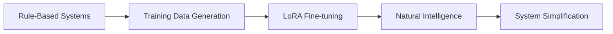

# Agent Development Pipeline: From Rule-Based to LoRA-Trained Intelligence

## Overview

This document outlines the Italian Teacher project's strategic approach to developing AI agents that evolve from explicit rule-based systems to naturally intelligent LoRA fine-tuned models. Our pipeline transforms scaffolding systems into training data, ensuring consistent personality and behavior throughout the evolution.

## Table of Contents

1. [Development Philosophy](#development-philosophy)
2. [Current Phase: Rule-Based Intelligence](#current-phase-rule-based-intelligence)
3. [How Current Systems Prepare for LoRA](#how-current-systems-prepare-for-lora)
4. [Training Data Generation](#training-data-generation)
5. [Post-LoRA Architecture](#post-lora-architecture)
6. [Migration Strategy](#migration-strategy)
7. [Quality Assurance & Validation](#quality-assurance--validation)

## Development Philosophy

### Why Build Scaffolding Systems?

Our approach follows the principle: **"Define explicit behavior before internalizing it."**



**Core Reasoning:**
- **Immediate Functionality**: Agents work from Phase 2 onwards
- **Behavioral Consistency**: Define personality patterns before training
- **Quality Benchmarks**: Establish what "good" agent behavior looks like
- **Training Data**: Generate thousands of personality-consistent examples
- **Validation Framework**: Compare LoRA performance against known baselines

## Current Phase (2): Rule-Based Intelligence

### Architecture Overview

Our agents currently use **layered intelligence systems** that explicitly control behavior, organized into separate directories for clean migration:

```python
# Current Marco Agent Architecture
class MarcoAgent:
    motivation_system: MotivationSystem      # Pre-LoRA (src/pre_lora/)
    error_tolerance: ErrorToleranceSystem    # Split (core framework + pre-LoRA engine)
    personality_config: AgentPersonality     # Core (src/core/)
    system_prompt: str                       # Pre-LoRA (src/prompts/)
```

### Current File Organization

```
src/
├── core/                           # CORE FRAMEWORK (will remain post-LoRA)
│   ├── motivation_context.py      # Lightweight motivation metrics & context
│   ├── error_tolerance.py         # Error tolerance framework with pluggable engines
│   ├── base_agent.py              # Agent base classes and infrastructure
│   ├── coordinator.py             # Multi-agent coordination
│   ├── agent_registry.py          # Agent discovery and selection
│   ├── conversation_state.py      # Conversation state management
│   └── event_bus.py               # Agent communication system
│
├── educational/                    # EDUCATIONAL DOMAIN (core will remain, templates removed)
│   ├── service.py                 # Educational service orchestration
│   ├── curriculum.py              # Learning paths and structured progression
│   ├── validator.py               # Answer validation with rich feedback
│   └── __init__.py               # Educational module interface
│
├── pre_lora/                       # PRE-LORA SYSTEMS (will be removed post-LoRA)
│   ├── motivation_system.py       # Template-based encouragement responses
│   ├── correction_engine.py       # Rule-based error detection and correction
│   ├── italian_corrections.py     # 500+ error patterns & correction mappings
│   └── educational_questions.py   # Template-based question generation
│
├── prompts/                        # PROMPT ENGINEERING (will be simplified post-LoRA)
│   ├── marco_system_prompt.py     # Heavy personality instructions
│   └── ...                        # Other agent prompts
│
└── agents/                         # AGENT IMPLEMENTATIONS (will be simplified post-LoRA)
    ├── marco_agent.py              # Integrates educational and motivation systems
    └── ...                         # Other specialized agents
```

### 1. Motivation System (`src/pre_lora/motivation_system.py`)

**Purpose**: Provides intelligent encouragement and progress recognition

**Current Implementation (Pre-LoRA):**
```python
class MotivationSystem:
    # WILL BE REMOVED POST-LORA:
    def get_encouragement(self, trigger: MotivationalTrigger) -> EncouragementResponse:
        templates = [
            "Fantastico! Stai andando benissimo! 🎉",
            "Perfetto! Hai capito tutto! Bravissimo!",
            "Che bravo! I tuoi progressi sono incredibili!"
        ]
        return random.choice(templates)

    # WILL REMAIN POST-LORA (moved to src/core/motivation_context.py):
    def update_progress(self, correct: bool, topic: str) -> None:
        self.progress_metrics.total_responses += 1
        # Track accuracy, streaks, topics mastered

    def detect_motivation_level(self) -> MotivationLevel:
        # HIGH/MEDIUM/LOW/FRUSTRATED based on metrics
        return self._analyze_performance()
```

**Post-LoRA Implementation (`src/core/motivation_context.py`):**
```python
class MotivationContext:
    # Only analytics and context preparation remain
    def get_context_for_model(self) -> Dict[str, Any]:
        return {
            "user_metrics": {"accuracy": 85.0, "motivation_level": "high"},
            "behavioral_triggers": {"needs_encouragement": False}
        }
```

**Training Data Generation:**
```
Input Context: {accuracy: 45%, consecutive_incorrect: 3, motivation_level: "LOW"}
Marco Response: "Non ti preoccupare, succede a tutti! Proviamo insieme... Stai imparando, è normale sbagliare!"

Input Context: {accuracy: 85%, streak: 5, motivation_level: "HIGH"}
Marco Response: "Fantastico! Stai andando benissimo! Sei pronto per qualcosa di più difficile?"
```

### 2. Error Tolerance System (Split Architecture)

**Purpose**: Provides intelligent, personality-driven error correction

**Core Framework (`src/core/error_tolerance.py`):**
```python
class ErrorToleranceSystem:
    # POST-LORA CORE - WILL REMAIN:
    def __init__(self, agent_personality, config, correction_engine):
        # Delegates to pluggable correction engines
        self.correction_engine = correction_engine  # pre-LoRA or LoRA-based

    def should_correct_error(self, error: DetectedError) -> bool:
        # Decision logic based on severity, frequency, user level

    def _determine_correction_style(self, error: DetectedError) -> CorrectionStyle:
        # Personality-based correction style selection
```

**Pre-LoRA Implementation (`src/pre_lora/correction_engine.py` + `italian_corrections.py`):**
```python
class PreLoRACorrectionEngine:
    # WILL BE REMOVED POST-LORA:
    def detect_errors(self, text: str) -> List[DetectedError]:
        # 500+ regex patterns + direct corrections
        # Comprehensive Italian error database

    def generate_correction(self, original: str, error_type: ErrorType) -> Tuple[str, str]:
        # Template-based corrections with 300+ mappings
        return corrected_text, explanation

class ItalianCorrectionsDB:
    # WILL BE REMOVED POST-LORA:
    # 500+ error patterns covering:
    # - Irregular verbs (venire, volere, potere, etc.)
    # - Complex prepositions (dal medico, in macchina, a Roma)
    # - Pronoun systems (lo vedo, gli do, mi chiamo)
    # - Advanced grammar (subjunctive, conditionals)
    # - False friends and regional variants
```

**Training Data Generation:**
```
Input: "io ho essere felice" + Context: {user_level: "beginner", error_type: "verb_conjugation"}
Marco Response: "Bravissimo! Si dice 'sono felice' - hai quasi azzeccato tutto! Cosa ti rende così felice?"

Input: "la problema è difficile" + Context: {user_level: "intermediate", error_type: "gender_agreement"}
Marco Response: "Capisco! 'Il problema' - è maschile. Non ti preoccupare, anche gli italiani sbagliano a volte!"
```

### 3. Educational Domain Systems (`src/educational/`)

**Purpose**: Complete educational platform with structured learning paths, adaptive questioning, and comprehensive assessment

#### 3.1. Educational Service (`educational/service.py`)

**Core Integration Layer** - Orchestrates all educational functionality:

```python
class EducationalService:
    # POST-LORA CORE - WILL REMAIN:
    def __init__(self, motivation_context, error_tolerance, curriculum_manager, validator):
        # Integrates with motivation tracking and error tolerance
        self.motivation_context = motivation_context
        self.curriculum_manager = curriculum_manager  # Learning progression
        self.validator = validator                     # Rich answer validation

    def start_learning_session(self, student_id, session_type):
        # Creates adaptive learning sessions based on curriculum position

    def process_answer(self, session_id, user_answer, agent_personality):
        # Advanced validation with personality-driven feedback
        # Updates motivation context with detailed error analysis
        # Tracks curriculum progression and mastery
```

#### 3.2. Curriculum Management (`educational/curriculum.py`)

**Structured Learning Progression** - CEFR-aligned learning paths:

```python
# 3 Complete Learning Paths:
italian_beginner = LearningPath(    # A1-A2 CEFR
    units=[
        "Unit 1: Greetings & Basic Phrases",
        "Unit 2: Essential Verbs (essere/avere)",
        "Unit 3: Numbers & Time",
        "Unit 4: Family & Descriptions",
        "Unit 5: Food & Dining"
    ]
)

italian_intermediate = LearningPath(  # B1-B2 CEFR
    units=[
        "Unit 6: Past Tenses (Passato Prossimo)",
        "Unit 7: Travel & Transportation",
        "Unit 8: Prepositions & Complex Grammar"
    ]
)

italian_advanced = LearningPath(     # C1-C2 CEFR
    units=[
        "Unit 9: Subjunctive Mood",
        "Unit 10: Cultural Mastery & Idioms"
    ]
)

# Prerequisite tracking and automatic advancement
def get_next_topics(student_id) -> List[LearningTopic]:
    # Returns topics student should study next based on:
    # - Current curriculum position
    # - Completed prerequisites
    # - Performance analytics
```

#### 3.3. Educational Validator (`educational/validator.py`)

**Advanced Answer Assessment** - Rich feedback with personality integration:

```python
class EducationalValidator:
    # POST-LORA CORE - WILL REMAIN:
    def validate_answer(self, question, user_answer, student_context, agent_personality):
        return ValidationResult(
            is_correct=True/False,
            score_percentage=85.0,
            answer_quality=AnswerQuality.GOOD,  # EXCELLENT/GOOD/SATISFACTORY/POOR
            primary_feedback="Bravissimo! Quasi perfetto!",
            detailed_feedback=[
                {"type": "encouragement", "message": "Fantastico! 🎉"},
                {"type": "correction", "message": "Try: 'sono felice'"},
                {"type": "grammar_tip", "message": "Remember: io sono, tu sei..."}
            ],
            suggestions=["Practice verb conjugation patterns"],
            grammar_notes=["Essere conjugation varies by person"],
            cultural_insights=["This expression shows Italian warmth"],
            next_steps=["Ready for more challenging questions!"]
        )
```

#### 3.4. Question Generation (`pre_lora/educational_questions.py`)

**Template-Based Questions** - WILL BE REMOVED POST-LORA:

```python
# 500+ Question Templates across 20+ topics:
question_templates = {
    "greetings": {
        "beginner": [
            {
                "type": QuestionType.FILL_IN_BLANK,
                "template": "Complete: 'Buon______, come stai?'",
                "answer": "giorno",
                "explanation": "'Buongiorno' is used for 'good day/morning'",
                "learning_objectives": ["Basic Italian greetings"]
            }
        ]
    },
    "grammar_verbs": {
        "intermediate": [
            {
                "type": QuestionType.GRAMMAR_CORRECTION,
                "template": "Correct: 'Ieri io ho essere al cinema.'",
                "answer": "Ieri io sono stato/a al cinema.",
                "explanation": "Use 'essere' with 'stato/a' for past location"
            }
        ]
    }
}

# 8 Question Types: Fill-in-blank, Translation, Conversation, Multiple Choice,
# Verb Conjugation, Grammar Correction, Vocabulary Match, Cultural Context
```

**Training Data Generation for LoRA:**
```
Educational Context: {curriculum_unit: "Unit_02_verbs", user_accuracy: 75%, motivation: "medium"}
Question: "Conjugate 'essere' for 'io': Io ______ italiano."
User Answer: "sono"
Marco Response: "Perfetto! 'Io sono' - hai capito benissimo! Sei pronto per il prossimo livello?"
```

### 4. System Prompt Engineering

**Current Approach:**
```python
def get_marco_system_prompt(user_level, context, session_info):
    return f"""
    # Marco - Il Tuo Amico Italiano 🇮🇹

    ## Chi Sei
    Tu sei **Marco**, un italiano di 28 anni da Milano...

    ## La Tua Personalità
    - Entusiasta e positivo: Celebri ogni piccolo progresso
    - Paziente e incoraggiante: Non ti arrabbi mai per gli errori

    ## Current Context
    - User Level: {user_level}
    - Accuracy: {context.get('accuracy', 'N/A')}%
    - Recent errors: {context.get('recent_errors', [])}
    - Motivation needed: {context.get('needs_encouragement', False)}

    ## How to Respond
    [Detailed behavioral instructions...]
    """
```

## How Current Systems Prepare for LoRA

### 1. **Behavioral Pattern Documentation**

Current systems capture Marco's personality patterns:

```python
# These patterns become training examples:
marco_patterns = {
    "encouragement_triggers": {
        "correct_answer": ["Bravissimo!", "Perfetto!", "Che bravo!"],
        "milestone_reached": ["Fantastico! Stai migliorando tantissimo!"],
        "struggling": ["Non ti preoccupare, succede a tutti!"]
    },
    "correction_styles": {
        "gentle": "Quasi perfetto! Prova così: '{correction}'",
        "encouraging": "Bravissimo! Solo una piccola cosa: '{correction}'"
    },
    "conversation_flows": {
        "greeting": "Ciao! Come va oggi? Hai voglia di chiacchierare?",
        "topic_transition": "Interessante! E dimmi, cosa ne pensi di..."
    }
}
```

### 2. **Context Structure Standardization**

Systems establish consistent context formats:

```python
# Standard context structure for LoRA training:
training_context = {
    "user_metrics": {
        "level": "beginner|intermediate|advanced",
        "accuracy": float,
        "consecutive_correct": int,
        "motivation_level": "high|medium|low|frustrated"
    },
    "conversation_state": {
        "topic": str,
        "session_duration": int,
        "recent_errors": List[str]
    },
    "agent_config": {
        "personality_traits": List[str],
        "correction_frequency": float,
        "patience_level": int
    }
}
```

### 3. **Quality Benchmarks**

Rule-based systems provide gold standard responses:

```python
# Evaluation dataset creation:
benchmark_cases = [
    {
        "input": "io ho essere stanco",
        "context": {"user_level": "beginner", "accuracy": 60},
        "expected_marco_behavior": {
            "includes_encouragement": True,
            "correction_style": "gentle",
            "maintains_conversation": True,
            "cultural_context": Optional
        },
        "rule_based_response": "Bravissimo! Si dice 'sono stanco' - quasi perfetto! Hai lavorato molto oggi?"
    }
]
```

## Training Data Generation

### Data Pipeline Process

1. **Conversation Simulation**
   ```python
   # Generate thousands of scenarios:
   scenarios = generate_learning_scenarios(
       user_levels=["beginner", "intermediate", "advanced"],
       topics=["greetings", "food", "travel", "grammar"],
       error_types=["vocabulary", "grammar", "pronunciation"]
   )
   ```

2. **Rule-Based Response Generation**
   ```python
   for scenario in scenarios:
       context = build_context(scenario)
       marco_response = marco_agent.generate_response(scenario.user_input, context)
       training_pairs.append((scenario, context, marco_response))
   ```

3. **Quality Validation**
   ```python
   # Ensure training data meets personality standards:
   for pair in training_pairs:
       assert validate_marco_personality(pair.response)
       assert check_encouragement_balance(pair.response)
       assert verify_cultural_authenticity(pair.response)
   ```

### Training Data Format

```jsonl
{"messages": [
    {"role": "system", "content": "You are Marco, enthusiastic Italian conversation partner..."},
    {"role": "user", "content": "io ho essere molto felice oggi"},
    {"role": "assistant", "content": "Che bello! Si dice 'sono molto felice' - suona più naturale! Ma dimmi, cosa ti rende così felice? 😊"}
], "metadata": {"user_level": "beginner", "accuracy": 65, "motivation_level": "medium"}}
```

## Post-LoRA Architecture

### Simplified Agent Structure

```python
# Future Marco Agent (Post-LoRA)
class MarcoAgentV2:
    def __init__(self, model: LoRAModel):
        self.model = model
        self.educational_service = LightweightEducationalService()  # Core framework only
        self.context_builder = LightweightContextBuilder()         # Minimal context prep

    async def generate_response(self, message: str, context: ConversationContext) -> str:
        # Educational context from core systems (no templates!)
        educational_context = self.educational_service.get_context_for_model()

        # Simple context preparation
        lightweight_context = {
            "user_level": context.user_level,
            "curriculum_position": educational_context["curriculum_position"],
            "accuracy": educational_context["accuracy"],
            "motivation_level": educational_context["motivation_level"],
            "recent_error_patterns": educational_context["recent_errors"][:3]
        }

        # Model handles everything else naturally
        return await self.model.generate(message, lightweight_context)
```

### What Gets Removed

**Template-Based Educational Systems** (from `pre_lora/`):
```python
# REMOVED: Template-based question generation
question_templates = {
    "greetings": ["Complete: 'Buon______, come stai?'"],
    "grammar": ["Correct: 'Ieri io ho essere al cinema.'"]
}

# REMOVED: Template-based encouragement
encouragement_templates = {
    "correct": ["Bravissimo!", "Perfetto!", "Fantastico!"],
    "incorrect": ["Non ti preoccupare!", "Proviamo insieme!"]
}

# REMOVED: Rule-based error correction
def generate_correction_response(error_type, style="gentle"):
    templates = correction_templates[error_type][style]
    return random.choice(templates).format(correction=correct_answer)
```

**Template-Based Motivation System** (from `pre_lora/motivation_system.py`):
```python
# REMOVED: Explicit response assembly
class MotivationSystem:
    def get_encouragement(self, trigger: MotivationalTrigger):
        templates = ["Fantastico!", "Perfetto!", "Che bravo!"]
        return random.choice(templates)

    def combine_response_elements(self, encouragement, correction):
        return f"{encouragement} {correction}"
```

**Complex Educational Prompt Engineering**:
```python
# REMOVED: 1000+ token educational system prompts
educational_system_prompt = f"""
You are Marco teaching Italian... [extensive educational instructions]

Question Types:
- Fill in blank: Ask "Complete: '____'"
- Grammar: Ask "Correct this sentence"
- Conversation: Respond naturally to...

Educational Examples:
- User: "io ho essere" → Marco: "Si dice 'sono'..."
- User: "la problema" → Marco: "Il problema..."
[hundreds of educational examples and rules]

Assessment Rubrics:
- Grammar errors: Correct gently with explanation
- Vocabulary mistakes: Provide alternatives
[detailed teaching instructions]
"""
```

### What Remains

**Educational Domain Core Framework** (`educational/`):
```python
# REMAINS: Educational service orchestration (without templates)
class EducationalService:
    def start_learning_session(self, student_id, session_type): ...
    def process_answer(self, session_id, user_answer): ...  # No templates
    def get_curriculum_overview(self, student_id): ...

# REMAINS: Curriculum management and learning paths
class CurriculumManager:
    def get_next_topics(self, student_id) -> List[LearningTopic]: ...
    def check_topic_completion(self, student_id, topic): ...
    def enroll_student(self, student_id, path_id): ...

# REMAINS: Answer validation framework (core logic only)
class EducationalValidator:
    def validate_answer(self, question, answer, context): ...  # No templates
    def assess_quality(self, score, analysis): ...
    def _analyze_answer(self, question, answer): ...
```

**Core Framework Systems** (`core/`):
```python
# REMAINS: Motivation analytics and context
class MotivationContext:
    def update_progress_with_errors(self, detected_errors): ...
    def detect_motivation_level(self) -> MotivationLevel: ...
    def get_context_for_model(self) -> Dict[str, Any]: ...

# REMAINS: Error tolerance framework
class ErrorToleranceSystem:
    def should_correct_error(self, error: DetectedError) -> bool: ...
    def detect_errors(self, text: str) -> List[DetectedError]: ...

# REMAINS: Agent infrastructure
class BaseAgent:
    def process_message(self, message: str): ...
    def get_personality_config(self): ...
```

**Configuration & Analytics** (lightweight data structures):
```python
# REMAINS: Student profiles and progress tracking
@dataclass
class StudentProfile:
    current_level: DifficultyLevel
    topics_mastered: List[LearningTopic]
    weak_areas: List[LearningTopic]

# REMAINS: Educational configuration
@dataclass
class EducationalConfig:
    questions_per_session: int = 3
    adaptive_questioning: bool = True
    difficulty_auto_adjust: bool = True
```

## Migration Strategy

### Phase 4.1: Pre-Training Optimization

1. **Extract Training Patterns**
   ```python
   # Document all current behavioral patterns
   pattern_extractor = PatternExtractor()
   marco_patterns = pattern_extractor.extract_from_agent(marco_agent)
   save_training_patterns(marco_patterns, "data/marco_behavioral_patterns.json")
   ```

2. **Generate Training Dataset**
   ```python
   # Create comprehensive training data
   dataset_generator = TrainingDataGenerator(marco_agent)
   training_data = dataset_generator.generate_scenarios(
       num_examples=10000,
       scenario_types=["conversation", "correction", "encouragement", "cultural"]
   )
   ```

3. **Create Evaluation Benchmarks**
   ```python
   # Establish quality baselines
   benchmark_suite = create_evaluation_benchmarks(marco_agent)
   baseline_scores = evaluate_agent_performance(marco_agent, benchmark_suite)
   ```

### Phase 4.2: LoRA Training

1. **Model Fine-tuning**
   ```python
   # Train LoRA adapter on generated data
   lora_config = LoRAConfig(
       r=16, lora_alpha=32, target_modules=["q_proj", "v_proj"],
       personality_focus="marco_conversationalist"
   )
   marco_lora = train_lora_adapter(base_model, training_data, lora_config)
   ```

2. **Validation Against Baselines**
   ```python
   # Compare LoRA performance to rule-based system
   lora_scores = evaluate_agent_performance(marco_lora, benchmark_suite)
   performance_comparison = compare_scores(baseline_scores, lora_scores)
   ```

### Phase 4.3: System Refactoring

1. **Remove Redundant Systems**
   ```python
   # Systematic removal of template-based logic
   deprecated_systems = [
       "motivation_system.template_generation",
       "error_tolerance.correction_templates",
       "prompt_engineering.response_assembly"
   ]
   for system in deprecated_systems:
       mark_deprecated(system)
       create_migration_guide(system)
   ```

2. **Implement Lightweight Architecture**
   ```python
   # Replace heavy systems with context preparation
   class LightweightMarco(BaseAgent):
       def __init__(self, lora_model):
           self.model = lora_model
           self.context_builder = MinimalContextBuilder()
   ```

## Quality Assurance & Validation

### Evaluation Framework

**Behavioral Consistency Tests:**
```python
def test_personality_consistency():
    test_cases = load_personality_test_cases()
    for case in test_cases:
        lora_response = marco_lora.generate(case.input, case.context)
        rule_response = marco_rules.generate(case.input, case.context)

        assert personality_similarity(lora_response, rule_response) > 0.8
        assert contains_encouragement(lora_response) == contains_encouragement(rule_response)
        assert correction_style_matches(lora_response, "gentle_marco_style")
```

**Performance Benchmarks:**
```python
def test_learning_effectiveness():
    user_scenarios = create_user_learning_scenarios()

    for scenario in user_scenarios:
        lora_conversation = simulate_conversation(marco_lora, scenario)
        rule_conversation = simulate_conversation(marco_rules, scenario)

        assert learning_outcome(lora_conversation) >= learning_outcome(rule_conversation)
        assert user_satisfaction(lora_conversation) >= user_satisfaction(rule_conversation)
```

### A/B Testing Framework

```python
class AgentComparisonFramework:
    def compare_agents(self, lora_agent, rule_agent, test_suite):
        return {
            "personality_consistency": self.test_personality(lora_agent, rule_agent),
            "learning_effectiveness": self.test_learning_outcomes(lora_agent, rule_agent),
            "conversation_quality": self.test_conversation_flow(lora_agent, rule_agent),
            "user_satisfaction": self.test_user_experience(lora_agent, rule_agent)
        }
```

## Benefits of This Pipeline

### 1. **Guaranteed Functionality**
- Marco works from Phase 2 onwards
- Immediate user testing and feedback collection
- Continuous system development and integration

### 2. **Training Data Quality**
- Personality-consistent examples
- Comprehensive scenario coverage (500+ question templates)
- Educational curriculum alignment (CEFR standards)
- Multi-error tracking and detailed analytics
- Validated behavioral patterns

### 3. **Educational Excellence**
- **Complete Learning Paths**: 3 CEFR-aligned curricula (A1-C2)
- **Structured Progression**: 10 curriculum units with prerequisite tracking
- **Advanced Assessment**: Rich feedback with 5 quality levels
- **Multi-Error Analytics**: Individual error tracking by type and severity
- **Adaptive Questioning**: Curriculum-based question selection
- **School-Ready Features**: Student profiles, progress tracking, detailed reporting

### 4. **Clean Architecture**
- **Domain Separation**: Educational systems isolated from core framework
- **Maintainable Code**: Clear module boundaries and responsibilities
- **Testing Independence**: Educational domain can be tested separately
- **Scalable Design**: Easy to add new educational features
- **Import Clarity**: `from educational.service import EducationalService`

### 5. **Measurable Improvement**
- Clear baselines for LoRA evaluation
- Quantifiable personality consistency
- A/B testing capabilities
- Comprehensive educational analytics

### 4. **Systematic Evolution**
- Planned obsolescence of scaffolding systems
- Smooth transition to natural intelligence
- Preserved analytics and configuration layers

### 5. **Risk Mitigation**
- Fallback to rule-based systems if LoRA underperforms
- Quality validation at every step
- Gradual migration with safety nets

## Conclusion

Our agent development pipeline transforms explicit rule-based intelligence into natural LoRA-trained behavior while maintaining personality consistency and educational effectiveness. The comprehensive educational domain we've built provides:

### **Complete Educational Platform**
- **500+ structured question templates** across 20+ learning topics
- **3 CEFR-aligned learning paths** (A1-C2) with 10 curriculum units
- **Advanced answer validation** with 5 quality levels and rich feedback
- **Multi-error analytics** tracking individual mistakes by type and severity
- **Adaptive curriculum progression** with prerequisite management

### **Clean, Maintainable Architecture**
- **Domain separation**: Educational systems cleanly separated from core framework
- **Template isolation**: All pre-LoRA templates contained in `pre_lora/` for easy removal
- **Framework preservation**: Core educational logic remains post-LoRA in `educational/`
- **Clear imports**: `from educational.service import EducationalService`

### **School-Ready Implementation**
- **Structured learning paths** with clear progression requirements
- **Detailed student analytics** for teachers and administrators
- **Assessment-friendly format** with comprehensive progress tracking
- **Personality-driven feedback** maintaining Marco's authentic Italian warmth

By building comprehensive scaffolding systems first, we ensure:

- **Immediate educational functionality** for Phase 2 onwards
- **High-quality training data** with educational context for LoRA fine-tuning
- **Measurable benchmarks** for educational effectiveness evaluation
- **Smooth migration path** to simplified, naturally intelligent architecture

This approach balances the need for working educational agents today with the goal of naturally intelligent agents tomorrow, ensuring Marco's authentic Italian personality and educational expertise shine through every stage of development.

---

**Related Documents:**
- [Core Architecture](./core-architecture.md) - System architecture overview
- [Agent Personalities](./agent-personalities.md) - Personality configuration details
- [Training Pipeline](./training-pipeline.md) - LoRA training methodology
- [Evaluation Framework](./evaluation-framework.md) - Quality assessment protocols